# 疗养旅游服务平台

一个面向集团员工的服务商品管理平台全栈原型。

平台的核心思路是：集团为员工发放一笔可使用的虚拟额度，员工可以浏览集团可见的疗养旅游服务商品并提交意向，后台工作人员负责跟进、转订单和确认额度消耗，最后通过导出数据完成线下对账。

> 本项目是个人作品和可运行原型，不接入真实支付，也不连接真实企业、员工或供应商数据。

## 项目做到了什么

可以把它理解成一个“集团员工福利服务的管理系统”：

- 管理人员可以创建集团、员工和员工额度。
- 管理人员可以创建服务商品，并决定哪些集团可以看到这些商品。
- 员工登录后，可以浏览自己所在集团能够使用的服务商品。
- 员工可以提交自己的出行或服务意向，但提交意向不会立即扣额度。
- 管理人员跟进意向后，可以把意向转成待确认订单。
- 管理人员确认订单后，系统才会扣减员工额度，并记录额度流水。
- 员工可以查看自己的意向、订单、额度余额和额度变化记录。
- 服务完成后，员工可以提交评价，管理人员可以在后台审核和管理评价。
- 管理人员可以导出意向、订单和额度流水，用于线下沟通和对账。
- 酒店可以作为一种服务商品，也可以作为疗养旅游商品的住宿选项。

## 核心业务流程

~~~
管理人员创建集团
    ↓
创建员工并发放虚拟额度
    ↓
创建服务商品并设置集团可见范围
    ↓
员工登录并浏览商品
    ↓
员工提交个人意向
    ↓
管理人员跟进意向
    ↓
意向转为待确认订单
    ↓
确认订单并扣减额度
    ↓
员工查看订单和额度变化
    ↓
导出数据进行线下对账
~~~

这里特意区分了“意向”和“订单”：员工表达想法时只是提交意向，不代表报名成功，也不会扣减额度；只有后台确认订单后，系统才会产生额度消耗。

## 功能模块

### 员工端

员工端是一个面向手机浏览器的 H5 应用，主要解决“员工查看和使用服务”的问题：

- 手机号密码登录和登录会话恢复
- 查看集团可见的服务商品
- 查看商品详情、图集、服务说明和参考额度
- 提交个人服务意向
- 查看意向跟进状态，并在允许的状态下撤销意向
- 查看个人订单、行程信息和商品专属方案
- 查看当前额度、已使用额度和额度流水
- 查看和提交完成订单后的评价

### 管理端

管理端面向平台运营人员，主要解决“平台配置、业务跟进和对账”的问题：

- 集团客户管理
- 员工账号和基础资料管理
- 员工额度发放和额度流水查看
- 服务商品创建、编辑、上架和集团可见范围配置
- 酒店商品、房型和房间图片管理
- 意向筛选、跟进和转订单
- 待确认订单编辑和订单确认
- 订单状态、额度明细和商品快照查看
- 员工评价查看、审核和展示状态管理
- 意向、订单和额度流水 Excel 导出
- 运营账号管理和页面级权限配置

## 技术架构

项目采用 pnpm workspace 管理的 monorepo 结构，将前端应用、后端服务和共享业务层放在同一个代码仓库中。

~~~
┌──────────────────────┐       ┌──────────────────────┐
│ 员工端 H5             │       │ 管理端 Web            │
│ React + TypeScript    │       │ React + TypeScript    │
│ Vite                  │       │ Vite                  │
└──────────┬───────────┘       └──────────┬───────────┘
           │                              │
           └──────────────┬───────────────┘
                          │ REST API
                ┌─────────▼─────────┐
                │ Fastify API       │
                │ Auth / Guards     │
                │ Core Services     │
                │ Read Models       │
                │ Export Services   │
                └─────────┬─────────┘
                          │ Drizzle ORM
                ┌─────────▼─────────┐
                │ PostgreSQL        │
                │ 业务数据、会话、   │
                │ 额度流水、订单快照 │
                └───────────────────┘

共享包：domain / contracts / application / mock-data
~~~

### 应用层

- apps/employee：员工端移动 H5，负责员工侧页面、路由和交互。
- apps/admin：管理端 Web，负责集团、员工、商品、订单、评价和导出管理。
- apps/api：Fastify 后端，负责认证、权限、业务规则、数据库访问和文件上传。

### 共享业务层

- packages/domain：领域模型、状态枚举、商品快照和酒店扩展模型。
- packages/contracts：前后端共享的请求/响应契约和 TypeBox 校验定义。
- packages/application：可独立测试的业务服务和内存实现，作为业务规则基线。
- packages/mock-data：本地 Seed 数据和业务服务测试数据。

### 数据和持久化

- PostgreSQL 保存集团、员工、商品、意向、订单、评价、额度账户和额度流水。
- Drizzle ORM 负责类型安全的数据库访问和 migration 管理。
- 商品和订单使用快照思路：订单确认时保存订单专属商品内容，避免商品后续编辑影响历史订单。
- 图片上传文件保存在服务端运行时目录，公开仓库不提交运行时上传数据。

## 关键工程设计

### Session 认证和服务端授权

登录后使用服务端 Session，Session Token 通过 HttpOnly Cookie 返回，数据库只保存 Token Hash。密码使用 scrypt 哈希后保存，不把密码或密码哈希返回给前端。

员工身份和运营人员身份都从服务端 Session 获取，员工只能访问自己的业务数据，管理端接口根据页面权限进行校验。

### 额度一致性

额度不是线上支付金额，而是集团员工福利额度的记录方式。系统遵循以下规则：

~~~
额度余额 = 已发放额度 - 已扣减额度 + 已退回额度
最终消耗额度 = 已扣减额度 - 已退回额度
~~~

订单确认、额度扣减和额度流水写入使用同一个 PostgreSQL 事务，并配合行级锁，避免并发确认订单时发生超额扣减。

### 意向和订单分离

意向用于表达员工的服务需求，订单用于记录已经确认的业务结果。两者分离后，后台可以在线下沟通完成后再调整订单内容和额度，而不会把员工最初提交的意向直接当成报名结果。

### 服务商品模型

系统统一使用“服务商品”概念。疗养旅游是第一版重点场景，酒店作为 hotel 类型服务商品接入，后续仍可以扩展保险、医疗或健康管理等服务类型，而不需要把核心订单模型写死成旅游项目。

## 目录结构

~~~
.
├── apps/
│   ├── admin/                 # 管理端 React + Vite
│   ├── employee/              # 员工端 H5 React + Vite
│   └── api/                   # Fastify + Drizzle + PostgreSQL API
├── packages/
│   ├── application/           # 业务服务和业务规则测试
│   ├── contracts/             # 前后端共享契约
│   ├── domain/                # 领域模型和状态定义
│   └── mock-data/             # Seed 和测试基线
├── scripts/                   # 本地验证和数据库辅助脚本
├── compose.dev.yml            # 本地 PostgreSQL
├── pnpm-workspace.yaml
└── package.json
~~~

## 项目截图

以下截图展示了管理端和员工端的主要业务页面。截图中的数据均为模拟数据，商品、酒店和房间图片均为 AI 生成的展示素材。

### 管理端：集团和员工管理

管理人员可以维护合作集团、集团联系人和员工归属关系，也可以查看员工账号状态和当前可用额度。

  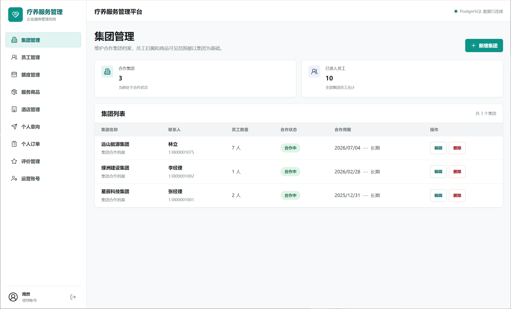

  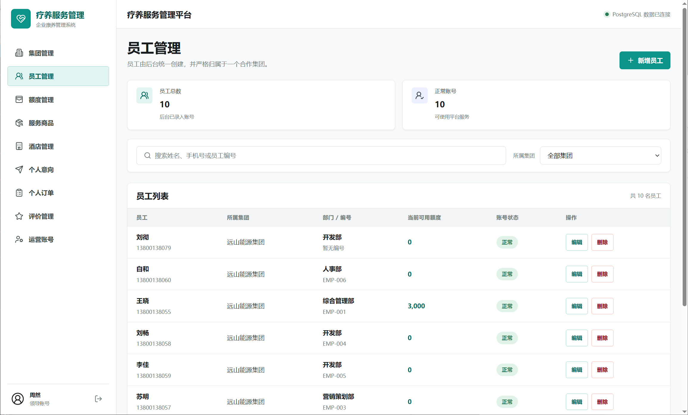

员工支持单个创建，也支持通过固定格式的 Excel 批量导入，适合集团员工数量较多的场景。

  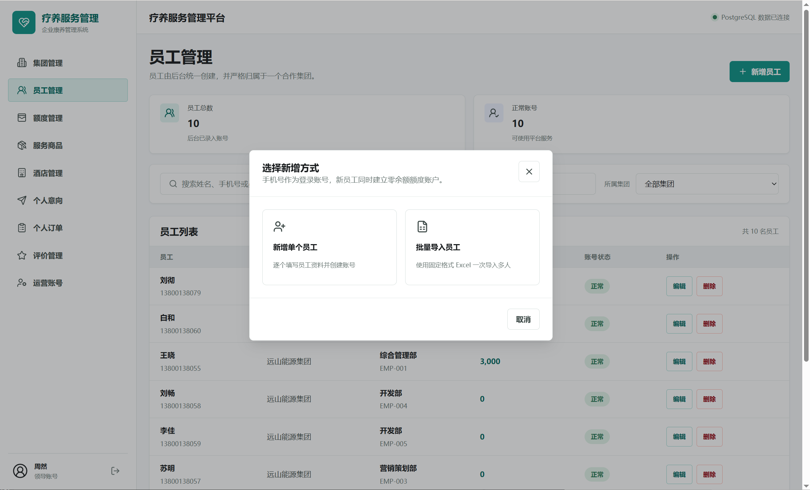

### 管理端：服务商品管理

管理人员可以统一维护疗养旅游和酒店等服务商品，设置商品类型、额度参考、集团可见范围和上架状态。

  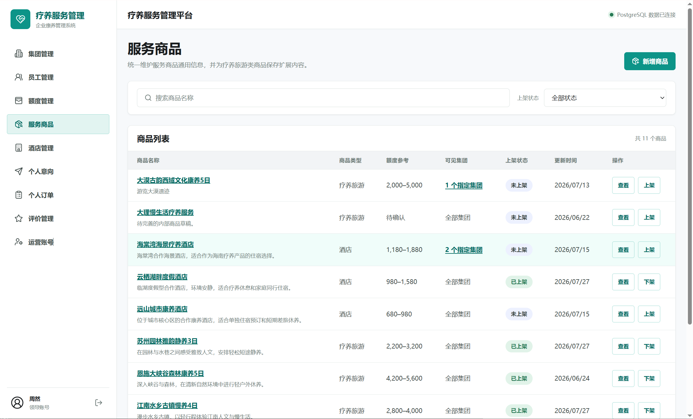

  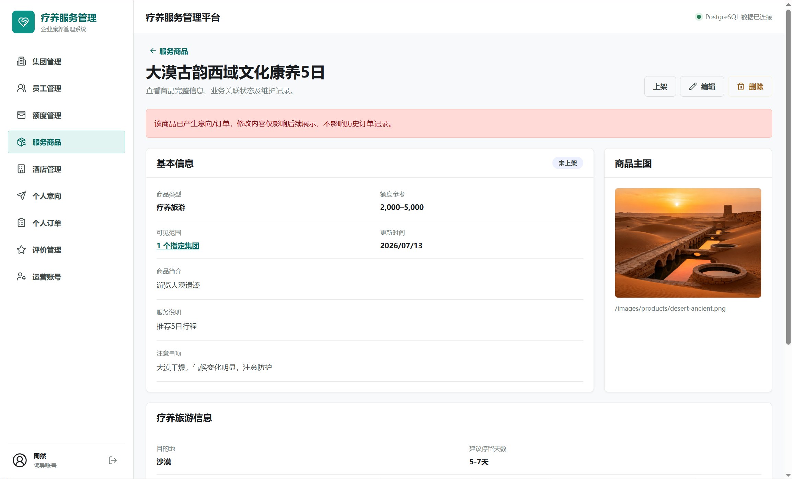

### 管理端：额度和订单管理

额度管理页面展示集团额度发放、员工已扣减、已退回和当前可用额度，帮助运营人员追踪额度变化。

  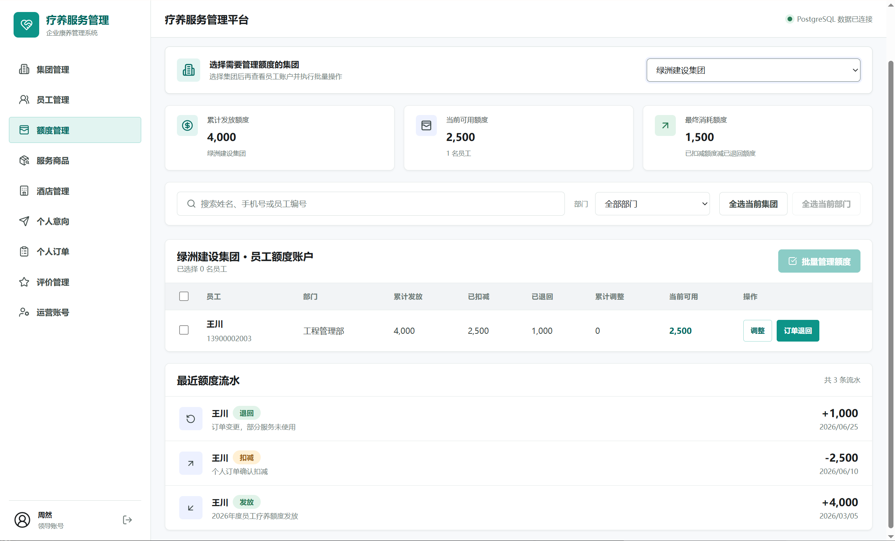

订单管理页面集中展示订单来源、出行安排、扣减与退回额度、最终消耗和订单状态。

  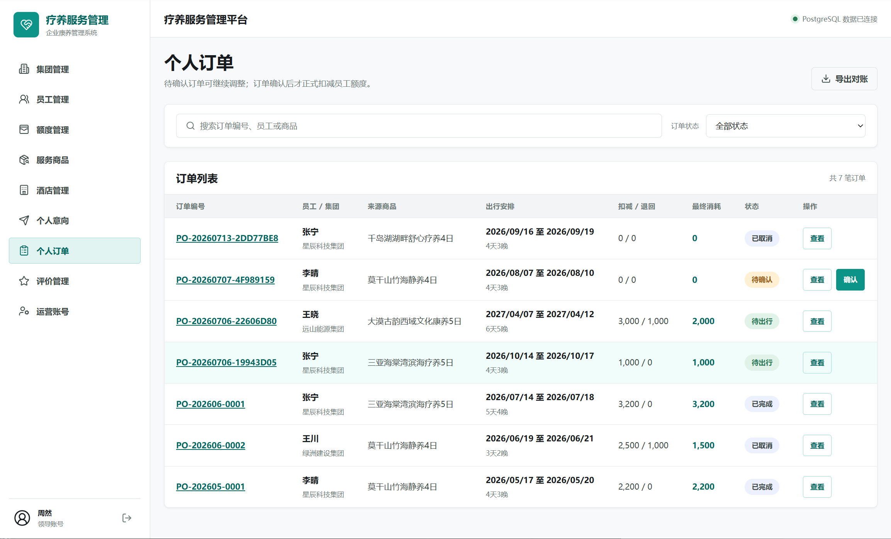

### 员工端：浏览服务商品

员工登录后可以看到所属集团可使用的服务商品，并根据目的地、主题或商品名称进行查找。

员工可以进入商品详情，了解适宜月份、建议停留时间、往返方式、住宿安排和参考额度，再决定是否提交意向。

<table>
  <tr>
    <td align="center">
      
服务商品列表

      
    </td>
    <td align="center">
      
服务商品详情

      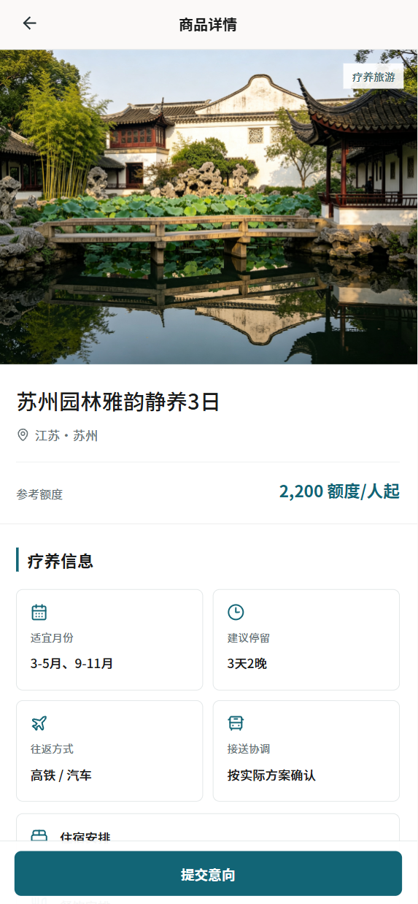
    </td>
  </tr>
</table>

### 员工端：意向、订单和个人信息

员工可以查看自己的意向状态，区分待跟进和已转订单的服务需求。

个人中心集中展示员工所属集团、员工编号、额度、意向、评价和订单入口。

<table>
  <tr>
    <td align="center">
      
个人意向

      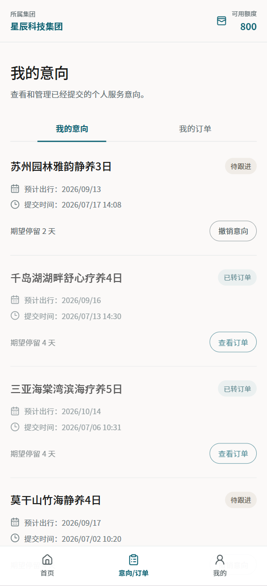
    </td>
    <td align="center">
      
个人中心

      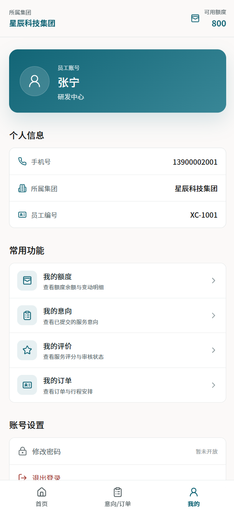
    </td>
  </tr>
</table>

订单详情页展示确认时间、行程安排、专属服务方案、服务说明和额度明细。

  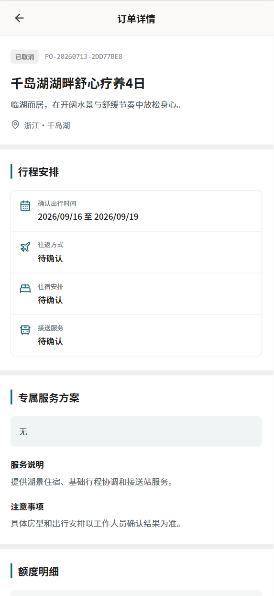

## 当前范围和限制

当前版本聚焦集团员工服务商品的核心闭环，不包含：

- 线上真实支付
- 多供应商入驻和供应商资质审核
- 机票、酒店的实时预订
- 真实短信验证码
- 员工线上退款申请
- 复杂统计大屏
- 发票和合同管理

订单履约状态目前主要在访问订单页面时同步，不是后台定时任务。

## 后续规划

- 增加团体项目的创建、名单管理和员工端查看
- 补充额度退回、评价审核和更多边界场景测试

## License

本项目采用 MIT License，详见 LICENSE。
