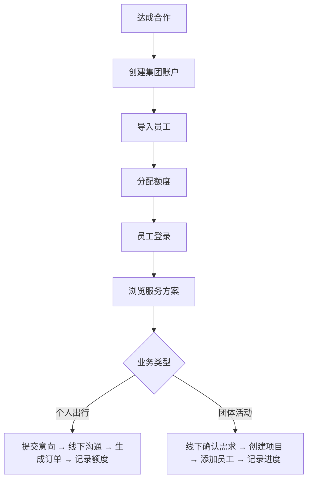
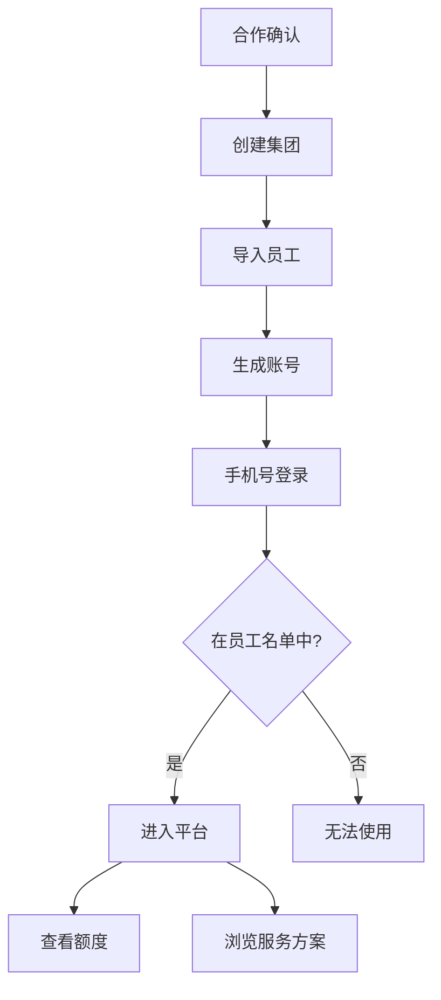
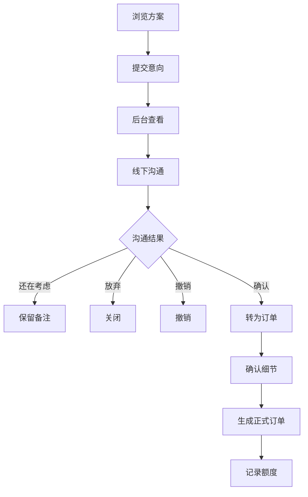
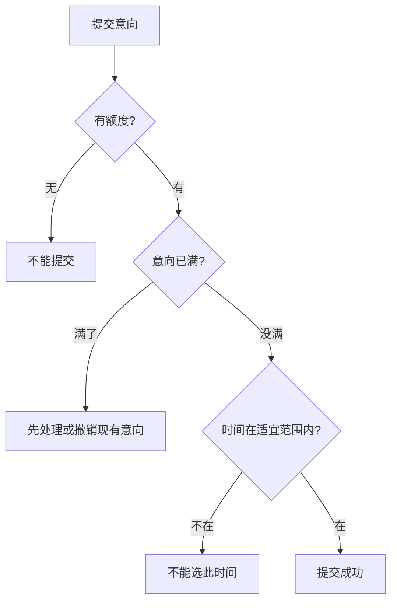
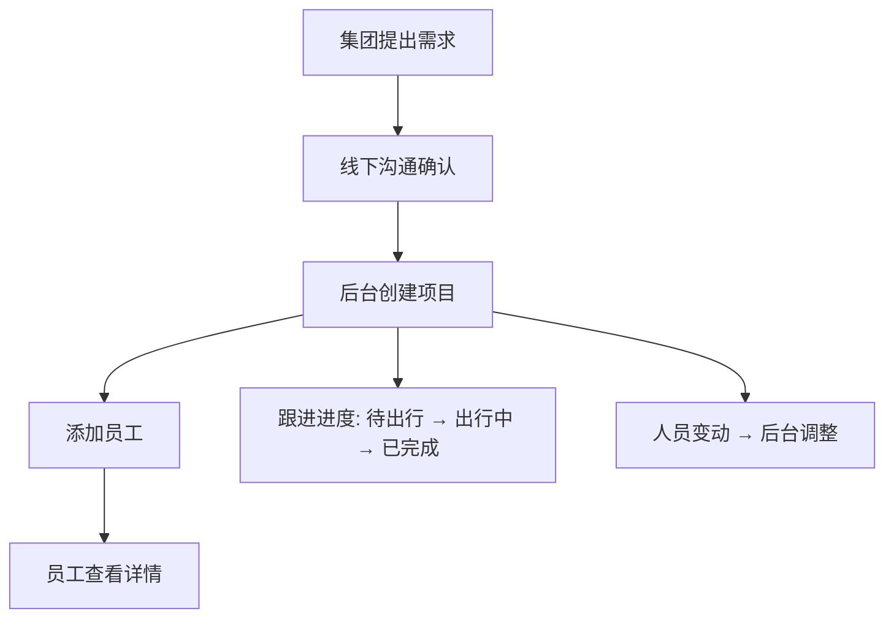
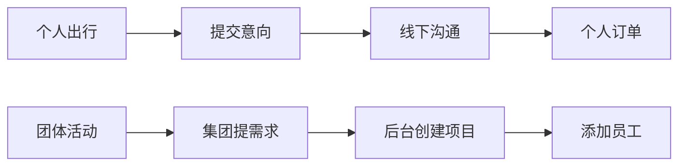
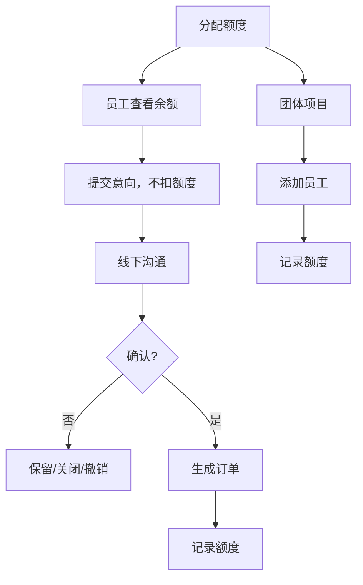
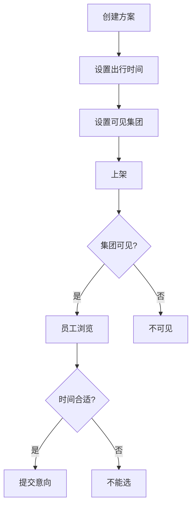

# 疗养旅游服务平台 业务流程说明 v0.2

## 一、平台是做什么的

这是我们为合作集团搭建的疗养旅游服务平台，主要做这几件事：

1. 让集团员工浏览可选的疗养服务方案
2. 让员工表达出行意向
3. 让我们的工作人员在后台跟进意向、管理订单
4. 管理集团统一组织的团体疗养或团建活动
5. 管理员工的疗养额度

平台不涉及线上付款。集团和我们的费用结算都在线下完成，系统只负责记录额度和订单。

---

## 二、整体业务流程

---

## 三、集团与员工账号

说明：

- 员工不能自己注册账号，由我们根据集团提供的名单统一创建。
- 员工登录后，只能看到所属集团对应的服务方案，不同集团看到的内容可以不同。
- 不同员工的额度可以不一样。

---

## 四、个人疗养服务

个人疗养服务面向员工个人出行。

这类服务不像传统旅游团那样安排"第几天去哪玩什么"，而是展示目的地的特色、适合出行的季节、交通、酒店、餐饮、接送等服务能力，员工根据自己的兴趣选择。

说明：

- 提交意向不扣额度，只是表达出行兴趣，不代表报名成功。
- 具体安排由工作人员线下沟通确认。
- 确认后才会生成正式订单并记录额度使用。

---

## 五、意向提交规则

为了避免员工一次提交太多意向，系统会做一些限制：

说明：

- 提交意向不扣额度。
- 每个员工同时最多保留 2 个待处理的意向（第一阶段）。
- "待处理"是指还在等待跟进或正在沟通中的意向。
- 已撤销、已关闭、已转订单的意向不占名额。

---

## 六、集团团体项目

团体项目用于集团统一组织的疗养、团建或集体出行。

这类活动不是员工个人发起的，而是集团和我们线下商定后，由我们在后台创建。

说明：

- 团体项目由后台创建，员工不需要先提交意向。
- 员工被加入后可以查看项目详情，但不能自行取消、退出或修改。
- 如果员工临时有事不能参加，由集团或我们线下确认后，再在后台调整。

---

## 七、个人订单和团体项目有什么区别

简单来说：

- **个人订单**：员工自己感兴趣，先提交意向，我们沟通确认后生成订单。员工可以撤销意向。
- **团体项目**：集团统一组织，由后台直接创建，员工只能查看，不能自己操作。

---

## 八、额度怎么用

说明：

- 额度由我们根据集团的规则分配给员工。
- 员工可以随时查看自己的额度余额。
- 提交意向不扣额度，订单确认后才记录使用。
- 团体项目的额度使用也由后台记录。
- 如果订单取消或员工退出等特殊情况，后台可以退回额度。

---

## 九、服务方案怎么展示

说明：

- 每个方案可以设置适宜出行的时间段，员工只能在这个范围内选择。
- 每个方案可以指定哪些集团能看到，员工只能看到自己所属集团对应的方案。
- 已上架的方案不能直接修改，需要先下架再编辑。

---

## 十、第一阶段核心规则

1. 本平台是我们自营的，不涉及多个供应商。
2. 员工账号由后台统一创建，员工不能自己注册。
3. 不处理线上支付，只记录额度。
4. 提交意向不扣额度，确认订单后才记录使用。
5. 个人疗养服务重点展示目的地、交通、住宿、餐饮和接送能力，不写每天的详细行程。
6. 团体项目由后台创建，员工只能查看。
7. 员工不能自行取消、退出或修改团体项目。
8. 不同集团看到的服务方案可以不同。
9. 第一阶段以展示方案、收集意向、后台记录和人工跟进为主。
